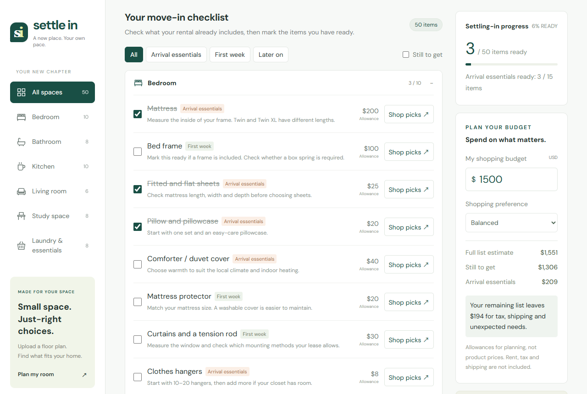
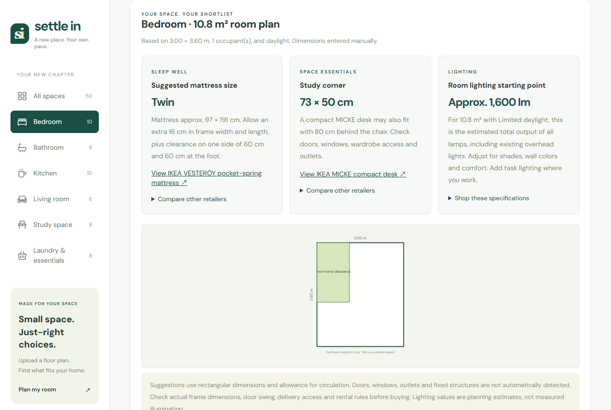

# Settle In / 安居清單

**A move-in checklist, budget and room planner for international students arriving in the US.**
Traditional Chinese and English.

**Live demo: [settle-in-student.vercel.app](https://settle-in-student.vercel.app)** · [English edition](https://settle-in-student.vercel.app/en/)



## What it does

- **Checklist.** 50 move-in items across six rooms, each tagged by priority (arrival essentials, first week, later on). Progress is saved in the browser.
- **Budget.** A planning allowance per item, a running total, and what is left for tax, shipping and surprises.
- **Where to buy.** Ten sourced product picks from Amazon, Target, Walmart and IKEA, plus a retailer search link for every item.
- **Room planner.** Upload a floor plan (JPG, PNG, WebP or PDF), calibrate its scale from one known length and select a room, or type the dimensions in m, cm or ft. The planner then recommends a mattress size, a desk footprint and a lighting level. It accounts for the room's use, space, number of occupants, the tallest sleeper's height and daylight, and it says plainly when something will not fit.
- **Two languages, one state.** The language switch keeps the current room, checklist, budget and room plans.



## Design choices

- **Nothing leaves the browser.** Floor plans are processed locally (PDF pages are rendered with a vendored copy of [PDF.js](https://github.com/mozilla/pdf.js)) and discarded on reload. The checklist and room dimensions live in `localStorage`. There are no accounts and no server.
- **Deterministic rules, no AI guessing.** Fit recommendations come from explicit dimension rules in [`dist/recommendations.js`](dist/recommendations.js), including the cases where nothing fits. Door, window and fixture detection is not attempted.
- **One source, two editions.** The English site is generated from the Chinese source by [`build-en.cjs`](build-en.cjs) using a reviewed dictionary ([`locales/en.json`](locales/en.json)). The build fails if any untranslated Chinese remains.
- **Agent-ready.** The page registers two [WebMCP](https://github.com/webmachinelearning/webmcp) tools, `get_checklist` and `set_checklist_items`, so a browser agent can read and update the checklist. An invalid item id is rejected without touching saved state. They were tested with an adapter, because no browser shipped native WebMCP at the time.
- **No build step.** Plain HTML, CSS and JavaScript modules.

## Run locally

```bash
node server.cjs          # http://127.0.0.1:4173
```

After editing the Chinese source in `dist/` or the dictionary in `locales/en.json`, regenerate the English edition:

```bash
node build-en.cjs
```

## Tests

End-to-end browser tests with Playwright (they use the installed Microsoft Edge):

```bash
npm install
node server.cjs &
npm run qa        # checklist, persistence, filters, product dialogs, WebMCP tools, room fit, units, PDF upload and calibration, mobile layout
npm run qa:en     # the full English UI, language switching in both directions, English PDF flow
```

## Data notes

Prices are reference snapshots checked on September 17, 2026, not live prices or stock. Missing or unreliable prices are left out, and checkout always happens on the retailer's own site. Product and room images are IKEA's own, loaded from ikea.com with attribution; no licence to them is claimed here.

## Deploy

Deployed on Vercel, which serves `dist/` (see [`vercel.json`](vercel.json)). Publish from this directory with `vercel deploy --prod`. The `index.html` at the repository root only forwards the old GitHub Pages address to the live site.

---

## 中文簡介

給剛到美國的留學生的入住採買清單與房間規劃工具：50 項分房間、分優先順序的採買清單，搭配預算試算、零售商選品連結，以及上傳平面圖、標定比例後的床墊、書桌與照明建議。所有資料只存在你的瀏覽器，不需要帳號。
